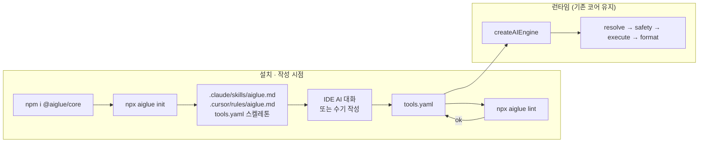

# aiglue 방향성 재정의 (MVP 설계)

- 작성일: 2026-04-20
- 상태: 초안 (사용자 리뷰 대기)

## 1. 배경

현재 aiglue는 `tools.yaml` 한 장으로 REST API를 자연어 인터페이스로 감싸는 Node 라이브러리다. 사용자는 이 YAML 포맷이 **진짜 최선인지**, 그리고 타겟 사용자·차별점이 무엇이어야 하는지 재점검하려 한다.

대화 결과 두 전제가 확정됐다.

- **타겟 사용자는 개발자.** YAML의 "비개발자도 편집 가능" 가치는 차별점이 아니다.
- **진짜 차별점은 "기존 개발 방식 그대로 개발해도, 기존 서비스에 AI 챗봇을 빠르게 붙일 수 있다"**. LangChain·Vercel AI SDK가 코드 기반이라 여전히 보일러플레이트가 크다는 점과 대비된다.

## 2. 포지셔닝

> **런타임 엔진 + "AI가 `tools.yaml`을 정확히 작성·유지보수하도록 돕는 인프라"**

핵심 아이디어: tools.yaml의 작성 자체는 사용자 IDE AI(Claude Code·Cursor 등)가 수행한다. aiglue는 그 작성이 정확해지도록 **공식 스키마·AI 지침·검증기**를 제공한다. OpenAPI/Swagger 파서·스키마 추론기는 내장하지 않는다.

YAML 포맷은 유지한다. 이유는 두 가지.

- 언어 무관 타겟 (백엔드가 Node가 아닐 수 있음 → 사이드카로 붙을 수 있어야 함)
- LLM이 생성하기 쉬운 포맷 (JSON Schema로 공식화하면 환각이 줄어듦)

## 3. 타겟 사용자 (MVP 스코프)

**자기 백엔드 소스를 소유한 팀**으로 한정한다.

- 사용자 본인(또는 팀)이 백엔드 API 소스 코드를 수정할 권한이 있다.
- 백엔드 언어는 무관. Node면 같은 프로세스에서 `createAIEngine()` 호출, 그 외 언어면 Node 사이드카로 aiglue 서버를 띄운다 (현재 구조 그대로).
- Claude Code·Cursor를 쓰거나, 쓰지 않더라도 README의 예시 카탈로그로 수기 작성이 가능해야 한다.

스코프 밖 (향후 릴리스):

- 프론트엔드 전용 아키텍처 (SPA/정적 사이트에서 공개 API 호출)
- 서버리스(Vercel·Cloudflare Workers) 1급 템플릿
- **API 소유권이 없는 상황**(타 팀·외부 SaaS API를 OpenAPI만 갖고 래핑)
- `@aiglue/client`, `@aiglue/mcp`, `generate-mcp` 등 기존 README 로드맵 항목
- `response_type: auto`의 AI 포맷팅
- `AIEClarifyResponse` 생성 경로

## 4. 레이어드 경로

사용자 환경에 따라 입력 수단만 다르고, 공통 기반(JSON Schema + lint CLI)으로 수렴한다.

| 환경 | 경로 | 체감 소요 (가이드값) |
|---|---|---|
| Claude Code·Cursor 사용 | `init` → IDE AI 생성 → lint → 실행 | 하루 |
| AI 개발 도구 미사용 | README 예시 카탈로그 복사 → 손수 조정 → lint → 실행 | 1~3일 |

"하루"는 사용자가 직접 언급한 체감값. "1~3일"은 수기 경로의 가이드 추정이며, 실제 공수는 API 규모에 따라 달라진다.

## 5. 아키텍처

## 6. 컴포넌트 (MVP)

| 컴포넌트 | 상태 | 역할 |
|---|---|---|
| `@aiglue/core` 런타임 | 기존 유지 + 최소 확장 | `engine.ts` 파이프라인(resolve · safety · execute · format)은 동일. `processMessage` · `HandlerRequest`에 `history?: ChatMessage[]` 릴레이만 추가 (§9 참조) |
| `tools.yaml` JSON Schema | 신규 | 공식 스키마. IDE 자동완성·LLM 생성 오류 방지의 근거. 경로 예: `packages/core/schema/tools.schema.json` |
| Claude skill / Cursor rule 자산 | 신규 | aiglue 스펙·작성 규칙·예시를 담은 AI 지침 문서. 패키지에 포함해 배포 (`packages/core/assets/`) |
| `npx aiglue init` | 신규 | 위 지침을 `.claude/skills/`·`.cursor/rules/`에 복사 + 최소 `tools.yaml` 스켈레톤 생성 |
| `npx aiglue lint <file>` | 신규 | JSON Schema 검증 + 시맨틱 체크 |
| README 예시 카탈로그 | 신규 | 주요 프레임워크(Express·FastAPI·Spring 등)별 tools.yaml 예시 스니펫. 수기 경로의 실용성 보장 |

## 7. 작성·유지보수 흐름 (개발자 관점)

1. `npm i @aiglue/core` → `npx aiglue init`
2. IDE AI에게 말함: "routes/ 읽고 tools.yaml 초안 만들어줘" (AI 도구 없으면 README 예시 복사)
3. AI가 `.claude/skills/aiglue.md`를 이미 알고 있어 정확한 스키마로 생성
4. `npx aiglue lint tools.yaml` 으로 누락·실수 점검
5. 서버에 `createAIEngine({ tools: './tools.yaml' })` 적용
6. 새 엔드포인트 추가 시 동일 IDE에서 "방금 추가한 X 반영해줘"

## 8. lint CLI가 잡아야 할 규칙

생성 시점(JSON Schema)과 런타임 시점(SafetyGate) 사이에 lint가 2차 방어선으로 들어간다. MVP에서 반드시 검출해야 할 것:

- JSON Schema 위반 (타입·필수 필드 누락)
- `endpoint`의 `:key`가 `params`에 없음
- `risk_level: write|critical`인데 `confirm_message` 누락
- `response_type: table`인데 `columns` 누락
- 중복 `name`

에러 메시지 품질에 투자한다. AI 생성이 아닌 사람이 수기로 쓸 때 가장 덕을 본다.

## 9. 런타임 에러 처리 · 대화 범위

현재 SafetyGate의 whitelist + risk_level 분기, Executor의 상태코드 검사, Formatter의 에러 응답 빌더를 그대로 유지. 런타임 에러 코드 카탈로그(`RATE_LIMIT_EXCEEDED`, `TOOL_NOT_ALLOWED`, `API_ERROR`, `INTERNAL_ERROR` 등)도 그대로.

**대화 범위 결정**: aiglue는 "지시 → 액션" 실행기로 포지셔닝하며, 누적 대화·멀티턴 에이전트는 스코프 밖이다. 진짜 에이전트 경험이 필요하면 클라이언트가 LangGraph·Mastra 등을 aiglue 위에 얹어 aiglue를 tool 제공자로 호출한다.

**History 릴레이 (예외적인 런타임 추가)**: 엔진은 **stateless를 유지**하되, 클라이언트가 요청에 `history: ChatMessage[]`를 실어 보내면 엔진이 윈도우(기본 최근 10개, `createAIEngine({ history: { maxMessages } })`로 조정)로 잘라 `IntentResolver`에 릴레이한다. 용도는 `clarify` 후속 답변·`confirm` 수정 요청·짧은 파라미터 변경("지난주는?") 해석에 국한. `tool` 실행 결과의 원본 데이터는 history에 싣지 말 것 — 토큰 폭주 방지. 서버측 세션 저장은 도입하지 않는다 (수평확장 원칙 유지).

## 10. 테스트 전략

- **런타임 코어**: 현재 vitest 테스트 유지. `engine.test.ts`의 `_setProvider` 모킹 패턴 그대로.
- **JSON Schema**: 기존 픽스처(`tests/fixtures/erut-tools.yaml`·`sample-tools.yaml`)가 통과해야 함 (회귀 방지).
- **lint CLI**: 픽스처 YAML 3~5개(정상·오류 케이스별)로 lint 출력 스냅샷 테스트.
- **Skill 내용**: 자동 테스트는 어려우니 릴리스 전 실제로 Claude Code에서 한 번 생성 돌려보는 수동 스모크.

## 11. 우선순위 재정리

현재 README 로드맵의 순서를 조정한다.

- **MVP (이번 설계)**: JSON Schema · Claude skill/Cursor rule · `aiglue init` · `aiglue lint` · README 예시 카탈로그.
- **1.5차**: OpenAPI import (`npx aiglue import-openapi`) — 백엔드 소유 팀이 이미 유지하는 OpenAPI를 입력으로 활용하는 경로. 엔터프라이즈는 Claude Code 없어도 OpenAPI는 있을 가능성이 높음.
- **2차**: MCP export, `@aiglue/client`, 서버리스 템플릿, 프론트엔드 전용 시나리오, `aiglue serve` 내장 서버 모드.

## 12. 리스크

- **Claude Code·Cursor 생태계 종속성**: 스킬/룰 포맷이 바뀌면 자산 갱신 필요. 패키지 버전과 함께 따라가야 한다.
- **IDE AI 없는 세그먼트 커버리지**: 레거시 엔터프라이즈가 주 수요처인데 사내 AI 툴 도입이 늦을 수 있음. README 예시 카탈로그의 품질이 이 세그먼트의 가치를 결정한다.
- **JSON Schema의 정확도**: 현재 타입(`types.ts`)과 실제 런타임 사용 사이에 미묘한 불일치(예: `rate_limit` 필드는 타입에 있지만 per-tool 적용은 미구현)를 스키마에도 투영할지 결정 필요. 초안에서는 "타입 정의 기준"으로 기술하고 런타임 미구현은 설명 주석에 명시.

## 13. 열린 질문

- `aiglue init`이 생성하는 기본 `tools.yaml` 스켈레톤의 구체 형태 (구현 단계에서 결정).
- Claude skill 파일의 분량·구조 (스펙 전체를 담을지, 핵심만 담고 JSON Schema 링크할지).
- lint CLI의 출력 포맷 (텍스트·JSON 플래그 지원 여부).

이 세 가지는 구현 계획(`writing-plans`) 단계에서 결정한다.
